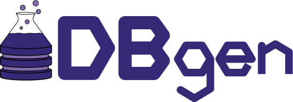

<!--
   Copyright 2021 Modelyst LLC

   Licensed under the Apache License, Version 2.0 (the "License");
   you may not use this file except in compliance with the License.
   You may obtain a copy of the License at

       http://www.apache.org/licenses/LICENSE-2.0

   Unless required by applicable law or agreed to in writing, software
   distributed under the License is distributed on an "AS IS" BASIS,
   WITHOUT WARRANTIES OR CONDITIONS OF ANY KIND, either express or implied.
   See the License for the specific language governing permissions and
   limitations under the License.
 -->

# DBgen

  

---

**Documentation**: <a href="https://dbgen.modelyst.com" target="_blank">https://dbgen.modelyst.com</a>

**Github**: <a href="https://github.com/modelyst/dbgen" target="_blank">https://github.com/modelyst/dbgen</a>

---

DBgen (Database Generator) is an open-source Python library for
connecting raw data, scientific theories, and relational databases.
These are some of the main features:

1.  Very easy to work with
2.  Integration with the PostgreSQL databases.

DBgen was initially developed by [Modelyst](https://www.modelyst.com/).

## What is DBgen?

DBgen was designed to support scientific data analysis with the following
characteristics:

1.  Transparent

    - Because scientific efforts ought be shareable and mutually
      understandable.

2.  Flexible

    - Because scientific theories are under continuous flux.

3.  Maintainable
    - Because the underlying scientific models one works with are
      complicated enough on their own, we can't afford to introduce
      any more complexity via our framework.

DBGen is an opinionated ETL tool. ETL tools exist but they rarely
give the tools necessary for a scientific workflow. Opinionated
aspect: it really cares about what the end product is (ID columns on
all the tables). We're dealing with a much more restricted ETL
problem (extracting and ).

Comparison to

1. [Airflow](https://airflow.apache.org/)

   - Has a priority for ETL scalability

2. [Fireworks](https://materialsproject.github.io/fireworks/)

3. [AiiDA](http://www.aiida.net/) or [Atomate](https://atomate.org/)
   - We don't focus on the actual submission of computational
     science workflows.

## What isn't DBgen?

1. An [ORM](https://en.wikipedia.org/wiki/Object-relational_mapping) tool (see [Hibernate](http://hibernate.org/orm/) for Java or [SQLAlchemy](https://www.sqlalchemy.org/) for Python)

   - DBgen operates at a higher level of abstrload, not exposing the user to low level SQL commands like SELECT or INSERT.

2. A database manager (see
   [MySQLWorkbench](https://www.mysql.com/products/workbench/),
   [DBeaver](https://dbeaver.io/), [TablePlus](https://tableplus.com/),
   etc.)
3. An opinioniated tool with a particular schema for scientific data /
   theories.

## Getting DBgen

### Via Github

Currently, the only method of installing DBgen is through Github. This is best done by using the [poetry](https://python-poetry.org/) package manager. To do this, first clone the repo to a local directory. Then use the command `poetry install` in the directory to install the required dependencies. You will need at least python 3.8 to install the package.

This installation process is still in development, please contact the DBgen if you encounter issues. Moving forward we plan to use make dbgen installable through `pip`.

### API documentation

Documentation of modules and classes can be found in
API docs \</modules\>.

#### Reporting bugs

Please report any bugs and issues at DBgen's [Github Issues
page](https://github.com/modelyst/dbgen/issues).

## License

DBgen is released under the [Apache 2.0 License](license/).
